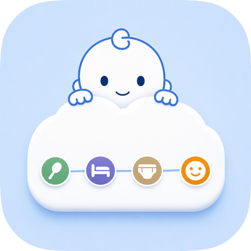
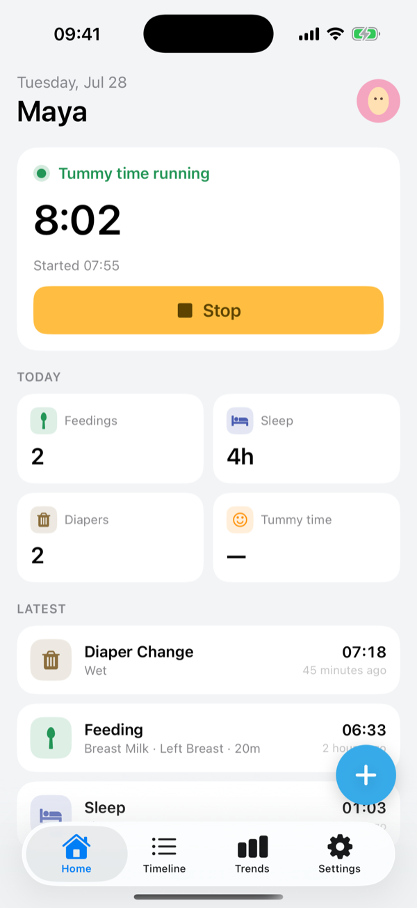
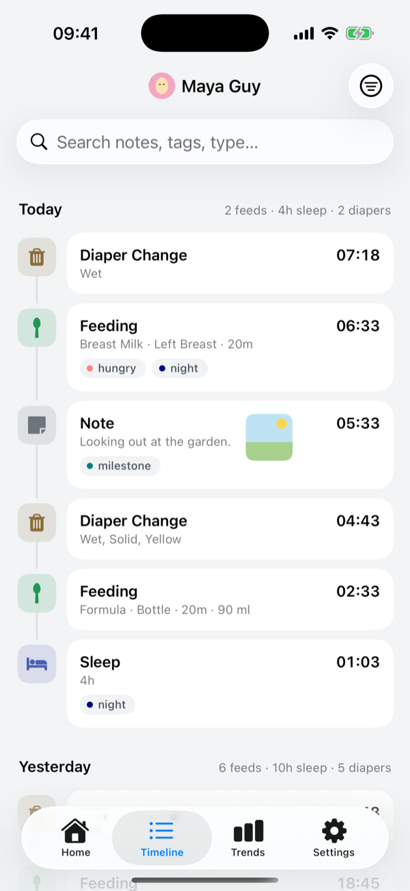
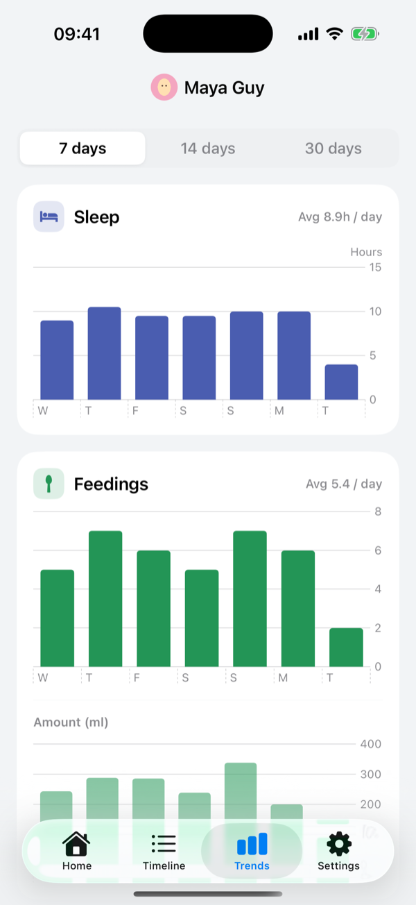
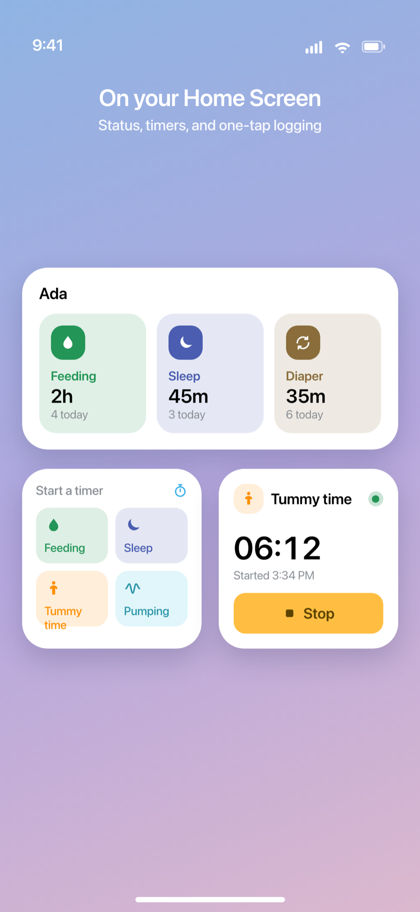
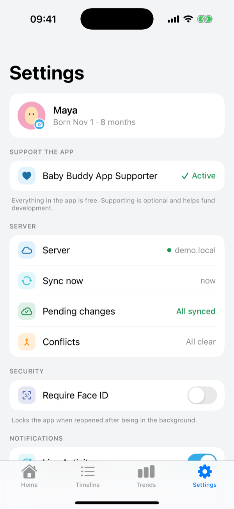

<div align="center">



# Baby Buddy Companion for iOS

### Baby tracking that lives on your phone and your server.

A fast, native iPhone client for your self-hosted [Baby Buddy](https://github.com/babybuddy/babybuddy).
Log feedings, sleep, diapers and more in a tap — with widgets, trends and private sync.

<!-- ══ APP STORE BADGE ══════════════════════════════════════════════════════
     Pre-launch state: the shields.io "Coming soon" badge below.

     ON LAUNCH — replace the single badge line under this comment with Apple's
     official badge, which is already committed at Docs/app-store-badge.svg:

       [](https://apps.apple.com/app/id<APP_ID>)

     Then set `appStoreURL` in the babybuddyweb repo's hugo.toml so the
     marketing site's badge flips to a live link at the same time.
     ═════════════════════════════════════════════════════════════════════════ -->

[](https://babybuddy.app)

[](#build-it-for-your-own-iphone)
[](LICENSE.md)
[](https://babybuddy.app)

**Free. Every feature included.** No subscription, no trial, nothing locked.
Requires iOS 17+ and your own Baby Buddy server.

</div>

---

<div align="center">







</div>

---

## 2 a.m. One hand. No signal.

|  |  |
|---|---|
| **Works offline** | Log now, sync when you reconnect |
| **Face ID lock** | Private on your iPhone |
| **Widgets** | Home Screen, Lock Screen and StandBy |


## Every record type, color-coded like the app

**Feedings** · **Sleep** · **Tummy time** · **Pumping** · **Diapers** · **Medications** ·
**Growth** · **Notes**

Growth covers weight, height, head circumference, temperature and BMI. Tags, photos and
multiple children run through all of it.

## Features

| | |
|---|---|
| ⏱️ **Timers from a widget** | Start a feeding, sleep, tummy-time or pumping timer from the App Home Screen — stopping it files the record. |
| ⚡ **One-tap Quick Log** | A widget that files a complete diaper change — wet, solid or both — or a feeding, with a customizable default. |
| 🔴 **Live Activity** | A running timer ticks away on the Lock Screen and in the Dynamic Island. |
| 🕐 **Status at a glance** | Home Screen, Lock Screen and StandBy widgets show the last feed, sleep and change, plus today's counts. |
| ☁️ **Offline-first** | Every change saves instantly and syncs when your server is reachable. Waiting writes are listed and reversible. |
| 🔀 **Conflict-aware sync** | Resolve competing edits with Keep Mine, Keep Server or field-by-field Merge. |
| 📊 **Trends at a glance** | Daily sleep, feedings and wet-vs-solid diapers over 7, 14 or 30 days — charted from the local cache. |
| 📋 **One merged timeline** | Search and filter every record type in one offline, day-grouped feed, then load older activity on demand. |
| 👶 **Every child, one switch** | Swap between children and the dashboard, trends, timeline and widgets all follow. |
| 📷 **Photos & notes** | Add profile photos and note images now; uploads finish when you reconnect. |
| 🏷️ **Tags that match** | Reuse your server's color-coded tags or create one inline. |
| 🔒 **Locked down** | Credentials stay in your Keychain, with an optional Face ID or Touch ID lock. |
| 🎨 **Six app icons** | Swap the Home Screen icon under **Settings → Appearance → App Icon**. |

## Your baby's records stay with you

Baby tracking data syncs only between the app and your
[Baby Buddy](https://github.com/babybuddy/babybuddy) server — no developer account, no cloud
relay. The App Store build adds anonymous feature telemetry and purchase-receipt handling for
the optional tip, both described in [PRIVACY.md](PRIVACY.md).

**Builds you make from a clone send nothing anywhere.** This repository ships without a
TelemetryDeck App ID and without a RevenueCat key, so both integrations stay switched off
unless you supply your own (see [Docs/DEVELOPMENT.md](Docs/DEVELOPMENT.md)).

## Free, with an optional tip

Every activity type, live timer, widget, trend and photo is in the free app. If you want to
say thanks, **Settings → Baby Buddy App Supporter** offers three one-time amounts. Tipping
unlocks nothing — and it supports development of this companion app.

---

# Build it for your own device

You can build and run Baby Buddy Companion on your own device. The steps below produce a
signed build under **your** Apple Developer team.

### What you need

- **macOS with Xcode 16 or newer**
- **[XcodeGen](https://github.com/yonaskolb/XcodeGen)** — `brew install xcodegen`
- **A paid Apple Developer Program membership.** This is not optional. The app and its widget
  share data through an **App Group**, and App Groups are unavailable to free personal teams.
  On a free account the widgets cannot read your data at all.
- **A running Baby Buddy server** you can reach from your phone.

### 1. Clone

```bash
git clone https://github.com/kguy18/babybuddyios.git && cd babybuddyios
```

### 2. Make the identifiers yours

The project is wired to my personal team and bundle prefix. Signing will fail — and
the Keychain will fail *silently* — until you replace both. Pick your own reverse-DNS prefix
(e.g. `com.yourname`) and run:

```bash
grep -rl 'com\.kurtisguy' project.yml Sources Widgets Config Tests | xargs sed -i '' 's/com\.kurtisguy/com.yourname/g'
```

Then replace the two team IDs — the project default and the one baked into the Keychain
access group:

```bash
sed -i '' 's/547DWTTFY6/YOURTEAMID/g' project.yml Sources/Auth/KeychainStore.swift Config/BabyBuddy.storekit
```

Your 10-character Team ID is on the [Apple Developer membership
page](https://developer.apple.com/account#MembershipDetailsCard).

> [!IMPORTANT]
> `Sources/Auth/KeychainStore.swift` hardcodes the access group as
> `<TEAMID>.com.kurtisguy.BabyBuddy`. If you change the bundle prefix but not the team ID,
> the app builds and launches, then fails to save your server credentials with **no visible error**.

Finally, open `project.yml` and **delete the `com.apple.developer.associated-domains` block**
(the two `applinks:babybuddy.app` entries around line 74). Those universal links are bound to
the original app's team and bundle ID; they will never verify for your build, and leaving them
in can hold up provisioning.

### 3. Generate and open

```bash
xcodegen generate && open BabyBuddy.xcodeproj
```

`Sources/Info.plist` and both `.entitlements` files are generated from `project.yml` — edit the
YAML, not the generated files, and re-run `xcodegen generate` after any change.

### 4. Run on your iPhone

1. Plug in your iPhone and select it as the run destination.
2. In **Signing & Capabilities** for both the **BabyBuddy** and **BabyBuddyWidgets** targets,
   confirm your team is selected and Xcode has created provisioning profiles. Automatic signing
   registers the App Group and App IDs for you.
3. Press **Run**. On first launch, approve the developer certificate on the phone under
   **Settings → General → VPN & Device Management**.

### 5. Connect to your server

- **Scan a QR code** (fastest) — on your Baby Buddy site open **User → Add a Device** and tap
  **Scan QR Code** in the app. The QR carries both the server URL and API key, so the connection
  is filled in and validated automatically. Works for any self-hosted domain.
- **Enter manually** — type your server URL and the API token from your web **User → Settings**
  page.

### Building for the simulator

No signing or developer account needed:

```bash
xcodegen generate
xcodebuild -project BabyBuddy.xcodeproj -scheme BabyBuddy \
  -sdk iphonesimulator -destination 'platform=iOS Simulator,name=iPhone 17 Pro' \
  CODE_SIGNING_ALLOWED=NO build
```

Swap `build` for `test` to run the test suite. The simulator also has a demo mode that needs no
server at all — see [Docs/DEVELOPMENT.md](Docs/DEVELOPMENT.md).

---

## Under the hood

- **[Docs/ARCHITECTURE.md](Docs/ARCHITECTURE.md)** — the offline-first data flow, the single
  generic `LocalEntity` envelope shared by all 14 record types, and how conflict detection works
  against a server with no change marker.
- **[Docs/DEVELOPMENT.md](Docs/DEVELOPMENT.md)** — debug launch flags, demo mode, and the
  optional TelemetryDeck / RevenueCat configuration.
- **[Docs/InAppPurchaseArchitecture.md](Docs/InAppPurchaseArchitecture.md)** — how the optional
  supporter tip is wired.

## Acknowledgements

Baby Buddy Companion is an **unofficial** client for the open-source
[Baby Buddy](https://github.com/babybuddy/babybuddy) baby-tracking server, and is not affiliated
with, endorsed by, or sponsored by that project. The app's activity glyphs are extracted from
Baby Buddy's Fontello icon font (Font Awesome, MFG Labs, Entypo — all under the SIL Open Font
License 1.1). Full third-party license notices are in
[THIRD_PARTY_NOTICES.md](THIRD_PARTY_NOTICES.md), and are reproduced in-app under
**Settings → Acknowledgements**.

## Development
I used both Claude and Codex to build this project, it has been a fun experiment burning hundreds of thousands of tokens to create this app. I hope you find it useful.

## License

BSD 2-Clause — see [LICENSE.md](LICENSE.md).
